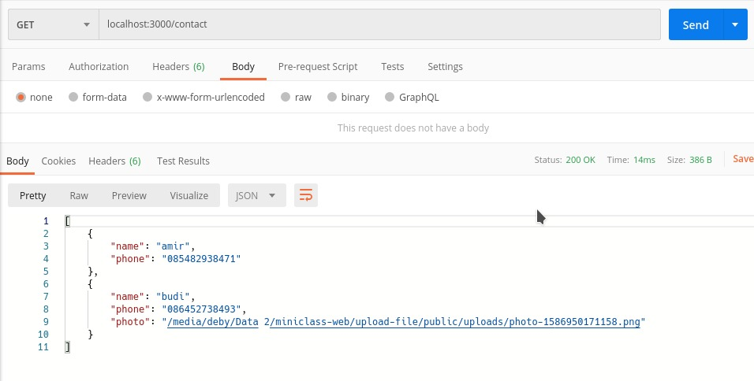

# Mengunggah File Menggunakan Express JS

## 1. Permasalahan

Selain menerima data dari body menggunakan format `url encoded` dan `json`, sebuah web server juga dapat menerima file dari client. Misalnya apabila kita akan membuat sebuah web yang memiliki fitur upload seperti upload foto profile.

## 2. Penjelasan

Untuk mengirim sebuah file, client harus mengirimkan data melalui body dengan format `form data`. Kemudian server dapat memparsingnya menggunakan middleware `multer`. `Multer` adalah middleware untuk Express dan Node.js untuk menghandle `form data` ketika user melakukan upload file.

## 3. Penjelasan Detail Materi


  Node JS sendiri tidak dapat menghandle multipart request. Sehingga membutuhkan Multer.  
  `Multer` adalah middleware node.js untuk menangani multipart / form-data, yang biasanya digunakan untuk mengunggah file.

  - cara mengirim form data dari frontend javascript  
    Menggunakan `FormData` object seperti berikut :
    ```
    const data = new FormData();
        data.append("username", "aka");
        data.append("password", "123");
        axios.post("/", data);
    ```
  - cara parsing form data ke req.files menggunakan middleware `multer`

    1. Buatlah folder untuk menyimpan file terlebih dahulu.
    2. Buat variable untuk menyimpan nama file yang akan di upload.

    ```javascript
    let filename;
    ```

    3. Aturlah lokasi penyimpanan file :  
       note : ubah kalimat dalam tanda `<>` sesuai dengan lokasi folder kalian

       ```javascript
       const storage = multer.diskStorage({
         destination: function (req, file, cb) {
           cb(
             null,
             path.join(__dirname, "<lokasi folder untuk menyimpan file>")
           );
         },
         filename: function (req, file, cb) {
           cb(
             null,
             (fileName =
               file.fieldname +
               "-" +
               Date.now() +
               path.extname(file.originalname))
           );
         },
       });
       let upload = multer({ storage });
       ```

    4. Buatlah rute untuk upload file (boleh POST/PUT) :  
        note : ubah kalimat dalam tanda `<>` sesuai dengan nama input file pada form kalian.
       ```javascript
       app.put(
         "/contact/upload",
         upload.single("<nama input file pada form data>"),
         (req, res, next) => {
           const file = req.file.path;
           console.log(file);
           if (!file) {
             res.status(400).send({
               status: false,
               data: "No File is selected.",
             });
           }
           next();
           //sesuaikan baris kode dibawah ini dengan data kalian
           // menyimpan lokasi upload data contacts pada index yang diinginkan (karena data contact berbentuk array)
           contacts[req.query.index].photo = req.file.path;
           res.send({ success: true });
         }
       );
       ```

    ```

    ```

## 4. Contoh Kasus

source code akhir contoh kasus :

### Langkah - langkah :

1. Buatlah folder dengan nama upload-file, lalu masuk ke dalam folder tersebut, dan ketikkan npm init untuk membuat file `package.json` yang akan mengatur semua dependency project kita.

   ```bash
   $ mkdir upload-file
   $ cd upload-file
   $ npm init
   ```

2. Install `express` dan `multer`

   ```bash
   $ npm i express multer --save
   ```

3. Buatlah file `server.js`  
    Masukkan Kode Program berikut :

   ```javascript
   // definisikan dependency yang dibutuhkan
   const express = require("express");
   const app = express();
   const multer = require("multer");
   //untuk menambahkan path
   const path = require("path");

   //menyimpan nama file ketika akan di upload
   let fileName;

   // menentukan lokasi pengunggahan
   const storage = multer.diskStorage({
     destination: function (req, file, cb) {
       cb(null, path.join(__dirname, "public/uploads"));
     },
     filename: function (req, file, cb) {
       cb(
         null,
         (fileName =
           file.fieldname + "-" + Date.now() + path.extname(file.originalname))
       );
     },
   });
   let upload = multer({ storage });

   const contacts = [
     {
       name: "amir",
       phone: "085482938471",
     },
     {
       name: "budi",
       phone: "086452738493",
     },
   ];

   function validateIndex(req, res, next) {
     if (
       req.query.index !== undefined &&
       contacts[req.query.index] === undefined
     ) {
       res.send({ success: false });
     } else {
       next();
     }
   }

   app.use(validateIndex);
   app.use(express.json());

   app.get("/contact", function (req, res) {
     res.send(contacts);
   });

   app.post("/contact", function (req, res) {
     contacts.push({ name: req.body.name, phone: req.body.phone });
     res.send({ success: true });
   });

   app.put("/contact", function (req, res) {
     contacts[req.query.index] = { name: req.body.name, phone: req.body.phone };
     res.send({ success: true });
   });

   app.delete("/contact", function (req, res) {
     contacts.splice(req.query.index, 1);
     res.send({ success: true });
   });

   // menerapkan middleware multer hanya pada rute berikut
   app.put("/contact/upload", upload.single("photo"), (req, res, next) => {
     const file = req.file.path;
     console.log(file);
     if (!file) {
       res.status(400).send({
         status: false,
         data: "No File is selected.",
       });
     }
     next();
     // menyimpan lokasi upload data contacts pada index yang diinginkan
     contacts[req.query.index].photo = req.file.path;
     res.send({ success: true });
   });

   app.listen(3000, function () {
     console.log("server running");
   });
   ```

4. Jalankan file server.js
5. Buka app postman untuk mengecek data array :

   

6. Masuk ke rute : `localhost:3000/contact/upload` dengan method PUT. Isikan index array dengan menggunakan req.query. Yaitu menambahkan `?index=1` setelah rute. Nilai 1 disesuaikan dengan index array yang akan kita tambahkan file photo.

     


7. Jika output telah success, maka file photo telah berhasil di upload :  
   
